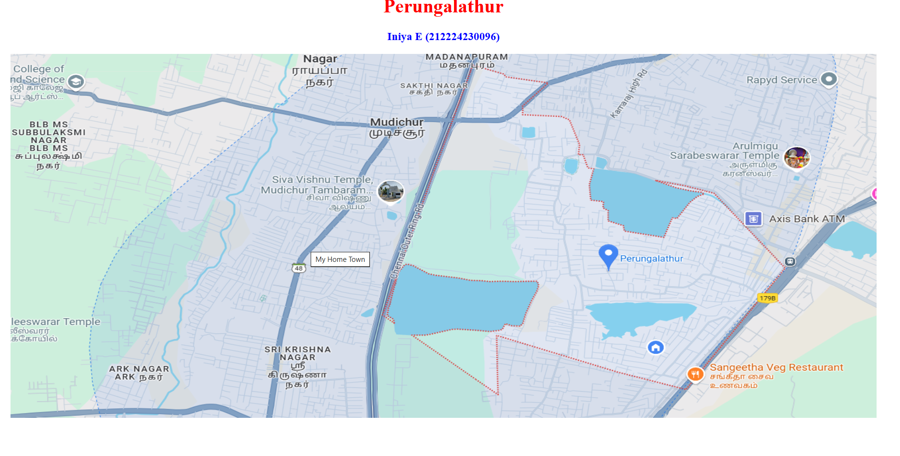
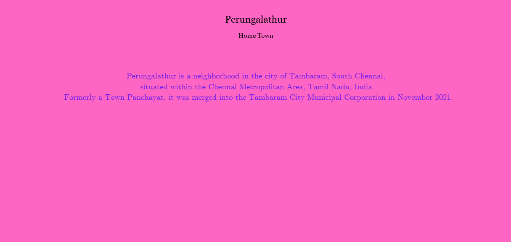
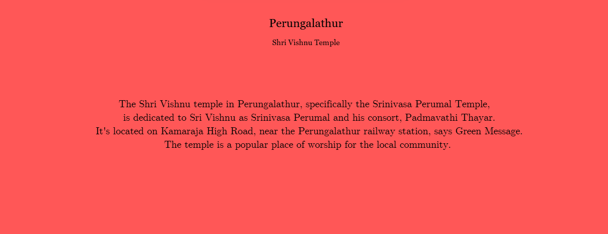
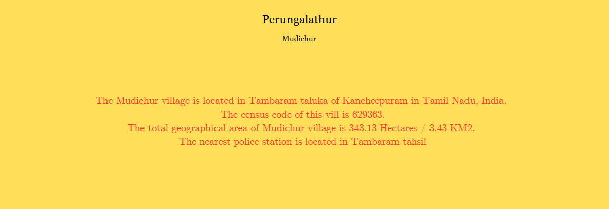

# Ex04 Places Around Me
## Date: 24.04.25

## AIM
To develop a website to display details about the places around my house.

## DESIGN STEPS

### STEP 1
Create a Django admin interface.

### STEP 2
Download your city map from Google.

### STEP 3
Using ```<map>``` tag name the map.

### STEP 4
Create clickable regions in the image using ```<area>``` tag.

### STEP 5
Write HTML programs for all the regions identified.

### STEP 6
Execute the programs and publish them.

## CODE
```
<html>
<head>
<title>My City</title>
</head>
<body>
<h1 align="center">
<font color="red"><b>Perungalathur</b></font>
</h1>
<h3 align="center">
<font color="blue"><b>Iniya E (212224230096)</b></font>
</h3>
<center>

<map name="MyCity">
<area shape="rect" coords="700,250,850,400" href="home.html" title="My Home Town">
<area shape="circle" coords="570,230,45" href="temple.html" title="Shri Vishnu Temple">
<area shape="rect" coords="640,200,30" href="place.html" title="Mudichur">

</map>
</center>
</body>
</html>


<!DOCTYPE html>
<html lang="en">
<head>
  <meta charset="UTF-8">
  <title>My Home Town</title>
  <style>
    body {
      background-color: pink;
      font-family: Georgia, serif;
      margin: 20px;
    }
    h1, h3 {
      text-align: center;
    }
    h1 {
      color: red;
    }
    h3 {
      color: blue;
    }
    .description {
      text-align: justify;
      font-size: 18px;
      color: red;
    }
  </style>
</head>
<body>
  <h1>Perungalathur</h1>
  <h3>Home Town</h3>
  <p class="description">
    Perungalathur is a neighborhood in the city of Tambaram, South Chennai, 
    situated within the Chennai Metropolitan Area, Tamil Nadu, India. 
    Formerly a Town Panchayat, it was merged into the Tambaram City Municipal Corporation in November 2021.
  </p>
</body>
</html>

<!DOCTYPE html>
<html lang="en">
<head>
  <meta charset="UTF-8">
  <title>My Home Town</title>
  <style>
    body {
      background-color: pink;
      font-family: Georgia, serif;
      margin: 20px;
    }
    h1, h3 {
      text-align: center;
    }
    h1 {
      color: red;
    }
    h3 {
      color: blue;
    }
    .description {
      text-align: justify;
      font-size: 18px;
      color: red;
    }
  </style>
</head>
<body>
  <h1>Perungalathur</h1>
  <h3>Shri Vishnu Temple - Devotional Centre</h3>
  <p class="description">
    The Shri Vishnu temple in Perungalathur, specifically the Srinivasa Perumal Temple, 
    is dedicated to Sri Vishnu as Srinivasa Perumal and his consort, Padmavathi Thayar.
    It's located on Kamaraja High Road, near the Perungalathur railway station, says Green Message.
    The temple is a popular place of worship for the local community. 
    
  </p>
</body>
</html>


<!DOCTYPE html>
<html lang="en">
<head>
  <meta charset="UTF-8">
  <title>My Home Town</title>
  <style>
    body {
      background-color: rgb(137, 176, 137);
      font-family: Georgia, serif;
      margin: 20px;
    }
    h1, h3 {
      text-align: center;
    }
    h1 {
      color: rgb(60, 0, 255);
    }
    h3 {
      color: rgb(255, 242, 0);
    }
    .description {
      text-align: justify;
      font-size: 18px;
      color: red;
    }
  </style>
</head>
<body>
  <h1>Perungalathur</h1>
  <h3>Mudichur</h3>
  <p class="description">
    The Mudichur village is located in Tambaram taluka of Kancheepuram in Tamil Nadu, India.
    The census code of this vill is 629363.
    The total geographical area of Mudichur village is 343.13 Hectares / 3.43 KM2. 
    The nearest police station is located in Tambaram tahsil.
    
  </p>
</body>
</html>


```

## OUTPUT





## RESULT
The program for implementing image maps using HTML is executed successfully.
